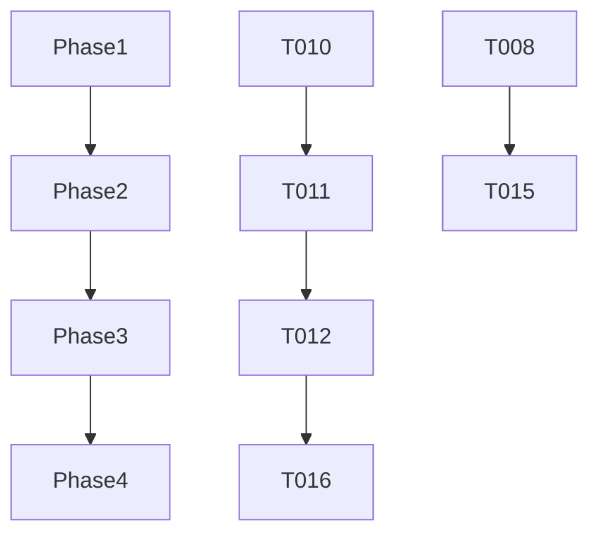

# Tasks: Enforce Constitution

**Branch**: `001-enforce-constitution`
**Status**: Completed

## Phase 1: Setup & Cleanup
Goal: Prepare the codebase structure and remove unnecessary abstractions.

- [x] T000 Run `composer test` to establish baseline pass rate before refactoring
- [x] T001 Enforce strict types in all existing PHP files in src/
- [x] T002 Delete `src/Registry/RepositoryContract.php` and update `Registry\Repository` to remove implementation
- [x] T003 Update `Registry\Service` to depend on concrete `Registry\Repository` instead of interface
- [x] T004 Delete `src/Hint/RepositoryContract.php` and update `Hint\Repository` to remove implementation
- [x] T005 Update `Hint\Service` to depend on concrete `Hint\Repository` instead of interface
- [x] T006 Delete `src/ShouldAsk/RepositoryContract.php` and update `ShouldAsk\Repository` to remove implementation
- [x] T007 Update `ShouldAsk\Service` to depend on concrete `ShouldAsk\Repository` instead of interface

## Phase 2: Foundation (New Modules & AST)
Goal: Implement new domain services and enhance Registry to support static AST analysis.

- [x] T008 [P] Create `src/KeyGenerator/Service.php` with `generate()` method using Artisan
- [x] T009 [P] Create `src/OptionResolver/Service.php` skeleton
- [x] T010 Implement `getStaticValue` and `getStaticKeys` methods in `src/Registry/Repository.php` using AST traversal
- [x] T011 Expose new AST methods in `src/Registry/Service.php` (`getStaticValue`, `getStaticKeys`)
- [x] T012 Implement `resolve` logic in `src/OptionResolver/Service.php` using `Registry\Service`

## Phase 3: Compliance Refactoring (User Story 1)
Goal: Refactor Wizard and Repositories to remove business logic and runtime config dependencies.

- [x] T013 [US1] Remove `Config::get` calls from `src/ShouldAsk/Service.php` and replace with `Registry` AST lookup
- [x] T014 [US1] Inject `KeyGenerator\Service` and `OptionResolver\Service` into `src/Wizard/Service.php`
- [x] T015 [US1] Refactor `src/Wizard/Service.php` to use `KeyGenerator` for APP_KEY logic
- [x] T016 [US1] Refactor `src/Wizard/Service.php` to use `OptionResolver` for strict keys logic
- [x] T017 [US1] Verify and remove any remaining `Config::get` calls in `src/Wizard/Service.php`
- [x] T018 [US1] Review `src/Registry/Repository.php` to ensure no conditional business logic exists
- [x] T019 [US1] Review `src/DotEnv/Repository.php` to ensure no conditional business logic exists

## Phase 4: Validation (User Story 2)
Goal: Verify compliance using static analysis and tests.

- [x] T020 [US2] Run `composer lint` (Pint + PHPStan Level 8) and fix reported issues
- [x] T021 [US2] Run `composer test` (PHPUnit) to ensure no regressions
- [x] T022 [US2] Manual check: Run `php artisan env:form --dry-run` to verify Wizard flow
- [x] T023 [US2] Verify no network functions (curl, file_get_contents http) are used in src/ (grep/search)

## Dependencies

## Parallel Execution Opportunities

- T008 (KeyGenerator) and T009 (OptionResolver) are independent.
- Cleanup tasks (T001-T007) can be done in parallel with Foundation planning.

## Implementation Strategy
1. **Cleanup First**: Remove interfaces to simplify the dependency graph.
2. **Build Foundation**: Enhance `Registry` capabilities before modifying consumers.
3. **Refactor Consumers**: Switch `Wizard` and `ShouldAsk` to use the new foundation.
4. **Verify**: Run strict analysis last to catch any loose ends.
